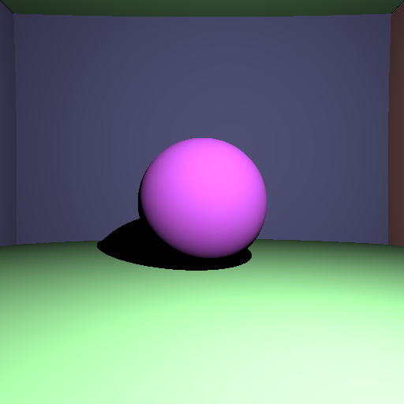

# CPU Path Tracer

A CPU-based path tracer written in C++ using **OpenMP** for parallelization and **stb_image** for texture loading. This project was developed as part of the **Computer Graphics – MOS 8.5** course at École Centrale Lyon, supervised by Nicolas Bonneel.

## Features (some are not done yet)

This path tracer supports a variety of rendering techniques and effects, including:
- **Hard and Soft Shadows**
- **Textures and Mesh Rendering**
- **Reflections and Transparency**
- **Gamma Correction**
- **Indirect Lighting**
- **Antialiasing**
- **Multiple Light Sources** and **Extended Light Sources**
- **Physically-Based Rendering (PBR) Materials**
- **Exponential Fog**
- **Bounding Volume Hierarchy (BVH) Trees** for optimization
- **Smooth Normal Interpolation**
- **Bidirectional Reflectance Distribution Functions (BRDFs)**
- **Phong Lighting Models**
- **Environment Maps**

## Project Context

> "This class will cover several aspects of computer graphics and is geared towards rendering. You will need to implement labs, a path tracer, mostly from scratch in C++. Little code will be provided: the course will need to be fully understood. I do consider that nothing is fully understood if you cannot implement it from scratch, and conversely, once understood, coding is merely a matter of touch typing. In return, you will get the satisfaction of having implemented your own tools producing beautiful computer graphics results."  
> — Nicolas Bonneel

## Important note

This project does not include a build system yet. Visual Studio project files are provided to set up and compile the project.

### Building and Running

1. Open the `.sln` file in Visual Studio.
2. Build the project using the **Release** or **Debug** configuration.
3. Run the compiled executable to generate rendered images.

### Screenshots

